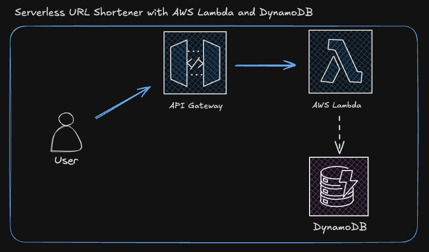

# 🚀 URL Shortener - Kotlin + AWS Lambda + Terraform

This is a **URL Shortener** built with **Kotlin**, deployed on **AWS Lambda**, and managed with **Terraform**.  
It uses **DynamoDB** to store URLs and **API Gateway** to handle HTTP requests.

---

## **🛠️ Technologies Used**
- **Kotlin** – Backend language.
- **AWS Lambda** – Serverless function execution.
- **API Gateway** – Exposes the URL shortener as an API.
- **DynamoDB** – NoSQL database to store the URL mappings.
- **Terraform** – Infrastructure as code for deployment.
- **Gradle** – Build tool to compile and package the project.

---

## **📌 Features**
✅ **Shorten URLs** – Convert long URLs into short ones.  
✅ **Redirect to Original URLs** – Retrieve and redirect users to the original link.  
✅ **Fully Serverless** – Runs on AWS Lambda, no need for managing servers.  
✅ **Scalable & Cost-Efficient** – DynamoDB provides automatic scaling and low-cost storage.  
✅ **Infrastructure as Code** – Easily deploy and manage with Terraform.

---

## **🚀 Setup & Deployment Guide**

### **1️⃣ Prerequisites**
Before deploying, make sure you have:
- **AWS CLI** installed and configured (`aws configure`)
- **Terraform** installed (`terraform --version`)
- **Gradle** installed (`gradle --version`)
- **An AWS IAM user with permissions for Lambda, DynamoDB, and API Gateway**
- **Java 17 SDK** installed (`java -version`)

---

### **2️⃣ Clone the Repository**
```sh
git clone https://github.com/franciscof12/url_serverless_shortener
cd url-shortener-kotlin
```

---

### **3️⃣ Build the Project**
Compile the project and generate a JAR file:
```sh
./gradlew clean shadowJar
```
This will create the file at:
```
build/libs/url_shortener.jar
```

---
## **4️⃣ Configuring `terraform.tfvars`**

Before deploying, you need to create a `terraform.tfvars` file inside the `terraform/` directory. This file contains sensitive AWS configuration details and **should NOT be committed to GitHub**.

### **📌 Create `terraform.tfvars`**
Inside the `terraform/` directory, create a file named **`terraform.tfvars`** and add the following content:

```hcl
aws_account_id = "YOUR_AWS_ACCOUNT_ID"

aws_gateway_base_url = "https://YOUR_API_ID.execute-api.YOUR_REGION.amazonaws.com/prod/"
```
---

### **Deploy with Terraform**
Initialize Terraform:
```sh
cd terraform
terraform init
```
Apply the Terraform configuration:
```sh
terraform apply -auto-approve
```
Once the deployment is complete, Terraform will output your **API Gateway URL**.

---

### **5️⃣ Set Environment Variables in AWS Lambda**
Manually update the Lambda function’s environment variables with your API Gateway URL:
```
AWS_GATEWAY_BASE_URL = https://YOUR_API_ID.execute-api.YOUR_REGION.amazonaws.com/prod/
```

---

### **6️⃣ Test the API**
#### **Shorten a URL**
```sh
curl -X POST https://YOUR_API_ID.execute-api.YOUR_REGION.amazonaws.com/prod/shorten \\
-H "Content-Type: application/json" \\
-d '{"long_url": "https://example.com"}'
```
**Response:**
```json
{"short_url": "https://YOUR_API_ID.execute-api.YOUR_REGION.amazonaws.com/prod/abc123"}
```

#### **Redirect to Original URL**
```sh
curl -i https://YOUR_API_ID.execute-api.YOUR_REGION.amazonaws.com/prod/abc123
```
**Response (302 Redirect to original URL)**:
```
HTTP/2 302
location: https://example.com
```
---
🚀 **Now your URL Shortener is fully deployed!** 🎉
